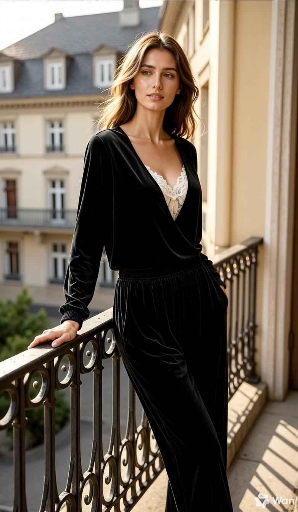

```
A hyper-realistic miniature diorama product advertisement featuring an oversized luxury skincare pump bottle labeled "LUXEVEIL Skin Science – Radiance Nourishing Body Lotion" in cream/beige with a polished gold pump top, placed on a circular platform. Tiny figurine construction workers dressed in yellow coveralls and white hard hats swarm around the bottle climbing scaffolding, painting the bottle with rollers, operating a tower crane, working near industrial tanks and pipework, and unloading a miniature flatbed truck. The scene includes metal scaffolding structures, industrial silos, orange traffic cones, wooden barricades, and storage barrels. The overall color palette is warm beige, cream, gold, and mustard yellow. Studio photography style with soft diffused lighting, no shadows, clean beige background. The concept metaphorically shows workers "crafting" or "building" the perfect lotion. Tilt-shift miniature aesthetic, ultra-detailed, commercial product photography, 8K resolution, photorealistic CGI render.
```


```
Please generate four lifestyle portrait photos of the model from Image 1 wearing the outfit from Image 2. The outfit features a high-end, luxurious black velvet long-sleeved top with a deep V-neck, subtly revealing a delicate white floral lace inner layer at the neckline. The bottom is paired with matching black loose-fit velvet trousers. The four scenes are as follows: 1. By a cast-iron railing on a balcony. 2. Inside a cozy and vintage-style study. 3. On a European city street. 4. In a semi-outdoor Western restaurant with a lively and soulful atmosphere. The images should be highly realistic, with vibrant colors and delicate textures, fully capturing an infectious and romantic lifestyle vibe.
```


 
 
 


```
你是一个小红书穿搭博主，请根据模特穿搭生成一张封面图片，
要求： 1.画面左侧是模特的OOTD全身图 2.右侧是衣服的展示，分别是上衣深棕色夹克、下装黑色百褶短裙、棕色靴子、黑色包包 
风格：实物摄影，要求真实，有氛围感，秋季美拉德色系穿搭
```


'''
傑作，頂級品質，超精細的動漫場景，夕陽西下時分，寧靜的日本河流，成千上萬片粉色櫻花花瓣如雪般輕柔飄落，兩岸櫻花盛開，橙粉色的天空和花瓣倒映在波光粼粼的水面上，遠處傳統的鳥居輪廓，柔和溫暖的輪廓光，陽光穿透花瓣，前景中漂浮著花瓣，營造出夢幻般的空靈氛圍，電影般的構圖，景深，散景，鮮豔而柔和的粉彩色調，高度精細的樹葉和水面紋理，8K分辨率。
'''


```
Transform the person in the photo into the style of a Funko Pop figure box, presented in isometric view.
The packaging is labeled with the title “JAMES BOND.”
Inside the box, display a chibi-style figure based on the person in the photo, along with their essential accessories: a pistol, a wristwatch, a suit, and other signature items.
Next to the box, show a realistic rendering of the actual figure outside the packaging, with detailed textures and lighting to achieve a lifelike product display.
```


```
In a casual, everyday style as if shot on a mobile phone, an anime figure of [Jackie Chan] is placed on a desk, striking an exaggerated and cool pose, fully equipped. Simultaneously, the corresponding real-life person also appears in the frame, striking a similar pose to the figure, creating an interesting visual contrast with the figure and the real person in the same frame. The overall composition is harmonious and natural, delivering a warm and vibrant, true-to-life visual experience.
```


```
Generate a Q-style 3D C4D-rendered character based on the person in the photo, dressed in a fashion-forward “outfit of the day” (OOTD) inspired by a specific profession.
Profession: Fashion Designer
– Keep the original facial features and character pose
– Stylize the character with a cute, long-legged chibi proportion
– Outfit and accessories should reflect the profession, including trendy designer wear, glasses, sketchbook or tablet, and stylish shoes
– Match the outfit with fashion accessories to complete the look
– Use a solid background color that complements the character’s overall color palette (no gradients or textures)

Composition: Aspect ratio: 9:16
Top text: “OOTD”
Left side: the full-body chibi character wearing the complete outfit
Right side: individual clothing items and accessories laid out separately, as if in a style breakdown
```


